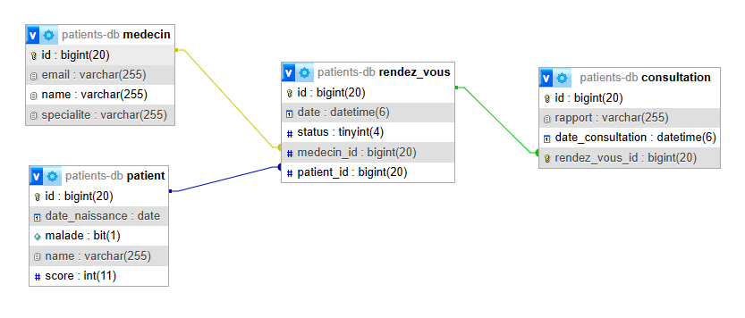

# Gestion de Patients avec Spring Boot et JPA

Ce projet Spring Boot, `Tp2HibernateJpaSpringApplication`, illustre une application de gestion de patients simple utilisant Spring Data JPA pour l'interaction avec la base de données. Il montre comment effectuer des opérations CRUD (Créer, Lire, Mettre à jour, Supprimer) sur des entités Patient. Le projet démarre avec une base de données H2 en mémoire avant de migrer vers MySQL.



## Configuration de l'Environnement

Assurez-vous que les outils suivants sont installés et configurés sur votre machine :

- JDK 17 ou version supérieure
- Maven 3.2 ou version supérieure
- Lombok Plugin pour votre IDE
- MySQL Server (pour la migration)

## Mise en place et Exécution

**Clonez le dépôt** :
   
   ```bash
   git clone https://github.com/ELMOUADDIBE/tp2-hibernate-jpa-spring.git
   ```

## Fonctionnalités
- Ajouter des patients, medecins, rendez-vous et consultations.
- Consulter tous les patients : Après l'ajout, l'application affiche tous les patients présents dans la base de données.
- Consulter, rechercher, modifier et supprimer des patients : La méthode run illustre également comment effectuer ces opérations.
   
## Technologies Utilisées
- Spring Boot pour le framework de l'application
- Spring Data JPA pour l'interaction avec la base de données
- Lombok pour réduire le boilerplate code
- H2 Database comme base de données initiale
- MySQL comme base de données cible pour la migration
